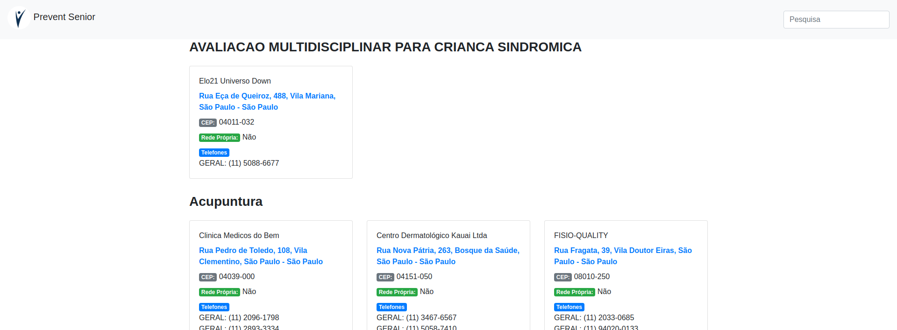
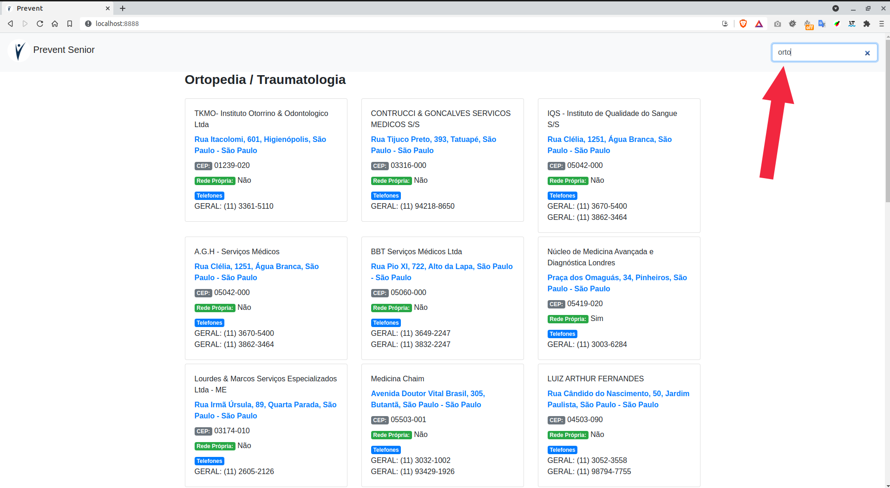
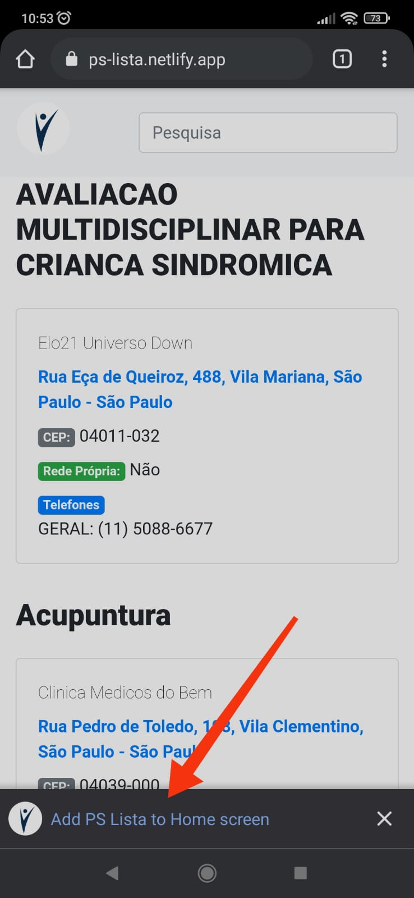
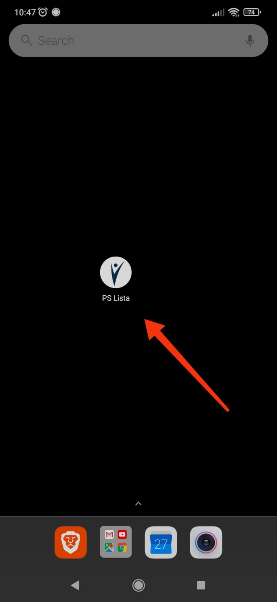

# PS Lista
Lista de endereços da Prevent Senior

# DEMO
## https://ps-lista.netlify.app

<br /> 

# Requisitos
1. [Node/NPM](https://nodejs.org/en/download/)
   

# Setup
```sh
git clone https://github.com/stdioh321/ps-list.git
cd ps-list
npm install
```

# Run
```sh
npm run start
```

Abra seu navegador:

## **http://localhost:8888**


| Index  | Pesquisa |
| ------------- | ------------- |
|   | 

| Instalar no Android  | Instalado na Home |
| ------------- | ------------- |
|  | 


# Referencias
* https://web.dev/progressive-web-apps/
